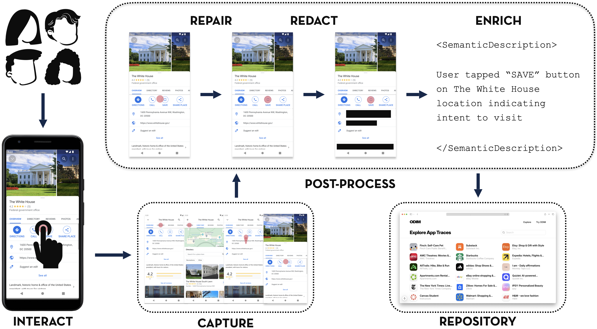

<div align="center">
  <h2>Interaction Mining</h2>
  <p>A web platform that enables capture, annotation, and redaction of interaction mining data.</p>

  </p>
    <a href="https://shields.io/">
      
    </a>
    <a>
      
    </a>
    <a>
      
    </a>
    <a>
      
    </a>
    <a>
      
    </a>
    <a href="LICENSE">
      
    </a>
  </p>


  <p>
    <a href="#about-the-project">About</a>
    · <a href="#features">Features</a>
    · <a href="#architecture">Architecture</a>
    · <a href="#tech-stack">Tech Stack</a>
    · <a href="#getting-started">Getting Started</a>
    · <a href="#troubleshooting">Troubleshooting</a>
    · <a href="#research-group">Research Group</a>
  </p>
  
</div>


---

## About the Project

* Interaction Mining is web platform that enables capture, annotation, and redaction of interaction mining data. Interaction Mining captures what real users do inside apps such as screens, UI interactions, and navigation paths directly from their devices.  
---
## ODIM (On Device Interaction Mining) 

* ODIM, abbreviated as On Device Interaction Mining, is a Next.js (React) web app that enables on-device capture of interaction mining data on an Android device.
* ODIM's web platform enables more in-depth capabilities, such as repairing, redacting, and annotating user interaction data.
* To learn more about the ODIM application, visit [ODIM Android on GitHub](https://github.com/datadrivendesign/odim-android).
* We are also actively developing support for **iOS interaction mining**, expanding ODIM’s capabilities across mobile platforms.
---
## Features

* **Privacy‑Preserving Data Collection**

  * Interface that allows for users to redact sensitive on-screen data (e.g., passwords, personal information) at their own discretion. The data is linked to a users’ account, and is not publicly viewable to the repository unless admin approved.

* **Data Management & Visualization**

  * Next.js web app to browse and analyze recorded flows to study user behavior, UI patterns, and pain points.

* **Cloud or Local Storage Integration**

  * Stores screenshots and metadata in MongoDB plus MinIO or AWS S3. Easily configurable via environment variables for local or cloud setup.

* **User Authentication & Contributions**

  * Supports Google OAuth login for managing contributors or shared datasets.

* **Extensible & Open Source**

  * Fully open source and customizable—extend for new analyses, visualizations, or data sources. Future plans include iOS support.

* **Automated Interaction Capture**

  * Uses Android’s Accessibility Service API to record user actions (taps, scrolls, text input) and screen content in the background, automatically generating task flows from real app use. To learn more about the ODIM application, visit [ODIM Android on GitHub](https://github.com/datadrivendesign/odim-android).
---

## Architecture

### App routes
- `/explore` — Browse datasets and flows.
- `/contribute` — Contributor instructions & upload.
- `/dashboard` — User dashboard for capture/task progress (signed-in).
- `/candidates` — Panel to display candidate task apps (useful for crowdsourcing).

### Capture workflow
- `/capture/new` — Create a new interaction capture session.
- `/capture/[captureId]/start` — Start capture session workflow (polls for incoming frame uploads).
- `/capture/[captureId]/upload` — File upload UI for the session.
- `/capture/[captureId]/edit` — Annotation/redaction interface (repair screens, redact sensitive data, review).
- `/capture/[captureId]/evaluate` — Review panel to assess capture quality (accessible to the capture owner and admins).

### Admin
- `/admin/tasks` — Admin panel to review captures/tasks before publishing to the repository.
- `/admin/users` — Admin panel to view all users.
- `/admin/users/[userId]` — Admin view for an individual user and their captures.

### Backend / API layer
- Next.js API routes (Node.js) that accept data from the Android client and serve frontend requests.

**API routes**
- `/api/auth/[...nextauth]` — NextAuth.js routes (Google OAuth).
- `GET  /api/capture/[captureId]` — Capture details.
- `POST /api/capture/[captureId]/upload/frames` — Upload screen frames.
- `POST /api/capture/[captureId]/upload/metadata` — Upload trace metadata.

### Database and Object Storage
- **MongoDB** for metadata (flows, users, etc.).
  - **Prisma** as the ORM; **MongoDB must run as a replica set** (Prisma needs this for transactions and `watch`/change streams). See [`/prisma/schema.prisma`](./prisma/schema.prisma).
- **MinIO** or **AWS S3** for large assets (screenshots).

### Auth
- NextAuth.js with Google OAuth 2.0.

### State management
- React hooks and context; integrate additional libraries as needed.
  
---

## Dependencies

- `@radix-ui/*` — UI component primitives  
- `lucide-react` — Icons library  
- `react-konva` — Canvas rendering for redaction  
- `swr` — Data fetching  
- `@dnd-kit/*` — Drag and drop utilities

## Tech Stack

- **React 19 (latest)**
- **NextAuth v5 (beta)** with Prisma adapter
- **Prisma 6.8.2** with **MongoDB provider**
- **TypeScript** with **strict mode**
- **Tailwind CSS v4 (beta)**
- **Development uses Turbopack** (Next.js bundler)

---

## Getting Started

### Prerequisites

- **Node.js 18+** (LTS recommended)
- **MongoDB** (Atlas or local **with replica set enabled**; Prisma requires a replica set)
- **Object Storage:** **MinIO** or **AWS S3** (for screenshots/large assets)
- *(Optional)* **Android Studio / Android device** if you plan to collect on-device interaction data locally

### Installation Guide

**TBD:** Please follow the most up-to-date instructions on our website:  
**https://interactionmining.org/contribute**

---

## Troubleshooting

* **`MongoError: connection refused`**

  * Ensure MongoDB is running
* **Web app not loading**

  * Double‑check `DATABASE_URL` and restart the app
* **Auth errors or missing env values**

  * Review `.env.local` and restart after updates

---

## Contact

Developed by the Data‑Driven Design Group at the University of Illinois Urbana‑Champaign. For research collaborations or academic inquiries, visit the [project website](https://www.interactionmining.org/) or Prof. Ranjitha Kumar’s page.

For questions, bug reports, or support, please open an issue on the repository’s GitHub Issues page.  
For sensitive inquiries (e.g., security concerns), contact **carlguo2@illinois.edu**.

---

## Report Bugs or Request Features

Use the GitHub Issue tracker to report bugs or suggest enhancements. This is the fastest and most transparent way to reach the maintainers and to help other users with similar issues.

---

## Citation

If you use this project in your research, please cite:

> Arsan, Deniz; Guo, Carl; Wellyanto, Muhammad Rizky; Ji, Erik R; Talton, Jerry O.; Kumar, Ranjitha. **On-Device Interaction Mining**. *Proc. ACM Hum.-Comput. Interact.*, 9(5), MHCI024, Sep 2025. [https://doi.org/10.1145/3743726](https://doi.org/10.1145/3743726)

```bibtex
@article{10.1145/3743726,
author = {Arsan, Deniz and Guo, Carl and Wellyanto, Muhammad Rizky and Ji, Erik R and Talton, Jerry O. and Kumar, Ranjitha},
title = {On-Device Interaction Mining},
journal = {Proc. ACM Hum.-Comput. Interact.},
volume = {9},
number = {5},
articleno = {MHCI024},
year = {2025},
month = sep,
doi = {10.1145/3743726},
url = {https://doi.org/10.1145/3743726},
}
