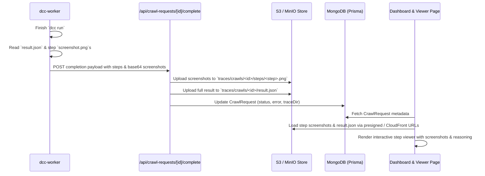

# DCC Crawl Results Viewer & Persistence Design

## 1. Overview
When a DCC automated crawl completes, interaction-mining must persist the run's findings and step-by-step screenshots to S3/CloudFront and provide a dedicated, interactive viewer page accessible from the user Dashboard.

## 2. Problem Statement
Currently:
1. DCC worker runs `dcc run` on D3PO or local machine, saving traces to local disk (`~/.dcc/traces/`).
2. Worker calls `/api/crawl-requests/[id]/complete` with only `{ status, error, traceDir }`.
3. In interaction-mining's dashboard, completed crawls only show a static badge that is unclickable because `crawlRequest.captureId` is `null`.
4. Users cannot see what the agent did, what screenshots were taken, or what errors occurred.

## 3. Architecture & Data Flow



## 4. Components

### A. Worker Completion Payload (`scripts/dcc-worker/`)
- In `job-runner.mjs`:
  - When `dcc run` exits, read `result.json`.
  - For each step directory in `<traceDir>/steps/`:
    - Read `screenshot.png` as base64 string.
    - Attach screenshot data to the corresponding step in `result.steps`.
- In `callback.mjs`:
  - Send the enriched payload:
    ```json
    {
      "status": "success" | "error" | "infeasible" | "needs_help" | "budget_exhausted",
      "error": "...",
      "traceDir": "...",
      "result": {
        "status": "...",
        "findings": ["..."],
        "steps": [
          {
            "step": 0,
            "reason": "...",
            "reflection": "...",
            "action": { "type": "type", "text": "..." },
            "latencyMs": 1234,
            "screenshotBase64": "..."
          }
        ]
      }
    }
    ```

### B. Completion Route Upload (`src/app/api/crawl-requests/[crawlRequestId]/complete/route.ts`)
- Parse and validate incoming payload with Zod.
- If `result` and steps with screenshots are present:
  - Upload each `screenshot.png` to S3 at `traces/crawls/${crawlRequestId}/steps/${step.step}.png` using `s3.send(new PutObjectCommand(...))`.
  - Replace the heavy `screenshotBase64` in the step record with the S3 key / relative path `traces/crawls/${crawlRequestId}/steps/${step.step}.png`.
  - Upload sanitized `result.json` to S3 at `traces/crawls/${crawlRequestId}/result.json`.
- Update `CrawlRequest` in MongoDB:
  - `status`: `COMPLETED` or `FAILED`
  - `error`: `dccError`

### C. Dashboard Link (`src/app/(signed-in)/dashboard/components/crawl-request-list.tsx`)
- Make the request row or badge clickable:
  - Completed requests show a green "Completed" badge with a "View Trace" / "View Results" button leading to `/crawl-requests/${crawlRequest.id}`.
  - Failed requests show a red "Failed" badge and link to `/crawl-requests/${crawlRequest.id}` to inspect why it failed.

### D. Dedicated Viewer Page (`src/app/(signed-in)/crawl-requests/[crawlRequestId]/`)
- Route: `/crawl-requests/[crawlRequestId]/page.tsx`
- Server component:
  - Validates user auth session and ensures user owns the `CrawlRequest`.
  - Fetches `CrawlRequest` from MongoDB.
  - Fetches `traces/crawls/${crawlRequestId}/result.json` from S3 (or generates presigned URLs for screenshots).
- Client viewer component:
  - **Header:** Goal description, target URL, status, start/end time, findings summary.
  - **Step Timeline / Navigation:** List of steps with action badges (`type`, `click`, `scroll`, `done`). Shows agent thoughts, latency, and step number.
  - **Screenshot Viewer:** Large screenshot display for the active step with zoom, fullscreen, and prev/next controls.
  - **Fallback / Empty State:** If a run failed before any steps were captured, display the error details cleanly.

## 5. Risk Assessment
- **Breaking:** None. Existing mobile trace workflows (`/capture/[id]/edit`) remain untouched.
- **Risky:** Worker memory when uploading multiple screenshots. Mitigated by limiting max steps to 12 (standard crawl budget) and streaming/batching.
- **Backend:** Safe extension of completion route and S3 bucket key paths.
- **Data Model:** No schema alterations needed.

## 6. Verification & Test Plan
1. **Worker Job Runner Test:** Run worker test suite (`pnpm test` / Node test runner in `scripts/dcc-worker`) verifying step screenshot bundling.
2. **Completion API Route:** Test with mocked S3 put command and valid payload.
3. **UI Verification:**
   - Verify dashboard renders clickable "View Results" link for completed crawls.
   - Open `/crawl-requests/[id]` with a sample trace, verify steps, thoughts, actions, and screenshots render seamlessly.
